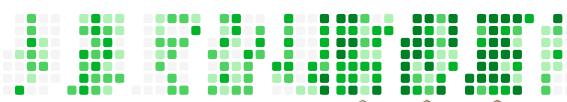

<!-- ═══════════════════════════════════════════════════════════════════ -->
<!--                        KAARTIK ARORA                              -->
<!--                   GitHub Profile README                           -->
<!-- ═══════════════════════════════════════════════════════════════════ -->

<!-- ─────────────── HERO ─────────────── -->
<div align="center">

  <!-- Typing animation -->
  

  <br/>

  <samp>Building AI-powered products, scalable backend systems, cloud workflows, and interactive web experiences.</samp>

  <br/><br/>

  <!-- CTA Badges -->
  <a href="https://kaartikarora-dev.onrender.com">
    
  </a>&nbsp;
  <a href="https://drive.google.com/file/d/1emgdC8KTqcL35wki3gfRyMvOpwYnp0Hd/view?usp=sharing">
    
  </a>

  <br/><br/>

  <!-- Social Links -->
  <a href="https://linkedin.com/in/kaartikarora01"></a>&nbsp;
  <a href="mailto:kaartikarora0001@gmail.com"></a>&nbsp;
  <a href="https://leetcode.com/u/Kaartik_Arora/"></a>&nbsp;
  <a href="https://github.com/number1coder01"></a>

  <br/>

  

</div>

<br/>

<!-- ─────────────── ABOUT + HIGHLIGHTS ─────────────── -->

<table align="center" border="0" cellspacing="0" cellpadding="0">
  <tr>
    <td width="55%" valign="top">

### 👨‍💻 About Me

- 🎓 **B.Tech IT** at **Delhi Technological University** (CGPA: 8.867)
- 💼 **SDE Intern** at **Wells Fargo** (5/3000+ selected)
- 🚀 Building **AI-powered products** & **scalable backend systems**
- 🧠 **1250+ DSA Problems** solved across platforms
- 🌟 **LeetCode Rating: 1810** (Top 6%)
- ☁️ Technical Team at **GDG DTU** & **AWS Cloud Club DTU**
- 🎯 **Adobe India Hackathon** — Top 1.5%
- 🥇 **Invictus BITS** — 1st Place Winner

</td>
    <td width="45%" valign="top" align="center">

### 📊 Consistency

<!-- LeetCode Streak -->


<br/>

<!-- Snake Animation -->
<picture>
  <source media="(prefers-color-scheme: dark)" srcset="https://raw.githubusercontent.com/number1coder01/number1coder01/output/github-contribution-grid-snake-dark.svg" />
  <source media="(prefers-color-scheme: light)" srcset="https://raw.githubusercontent.com/number1coder01/number1coder01/output/github-contribution-grid-snake.svg" />
  
</picture>

</td>
  </tr>
</table>

<br/>

<!-- ─────────────── ENGINEERING HIGHLIGHTS ─────────────── -->

<div align="center">

### 📊 Engineering Highlights

| Achievement | Details |
|:---:|:---:|
| 🏆 **LeetCode Rating** | **1810** |
| 💯 **Problems Solved** | **1250+** |
| 💼 **Internship** | **Wells Fargo** |
| 🥇 **Invictus BITS** | **1st Place** |
| 🎯 **Adobe Hackathon** | **Top 1.5%** |
| 🎓 **Education** | **B.Tech IT @ DTU** |
| 📈 **JEE Mains** | **98.8 Percentile** |
| 🏅 **JEE Advanced** | **AIR 14450** |
| 🔥 **Wells Fargo Selection** | **5 / 3000+** |

</div>

<br/>

<!-- ─────────────── FEATURED PRODUCT: RESUMIND ─────────────── -->

<div align="center">

## 🌟 Featured Product — Resumind

**AI-powered Resume Intelligence Platform**

</div>

<table align="center" border="0" cellspacing="0" cellpadding="0">
  <tr>
    <td width="50%" valign="top">

#### 🔍 The Problem
Most resume analyzers provide shallow ATS scores and generic feedback — they fail to address industry-specific requirements, phrasing impact, and real recruiter behavior.

#### 💡 The Solution
Resumind combines modern LLMs (OpenAI + Claude) to generate **deep technical resume reviews**, improvement suggestions, recruiter-focused feedback, and career guidance.

#### Tech Stack
<p>
  
  
  
  
  
  
</p>

</td>
    <td width="50%" valign="top">

#### 🏗 Architecture

```
         ┌─────────────────┐
         │  Resume Upload   │
         └────────┬────────┘
                  ▼
         ┌─────────────────┐
         │  Resume Parser   │
         └────────┬────────┘
                  ▼
    ┌─────────────┴─────────────┐
    │                           │
┌───┴───────┐          ┌───────┴───┐
│ OpenAI API│          │Claude API │
└───┬───────┘          └───────┬───┘
    │                           │
    └─────────────┬─────────────┘
                  ▼
         ┌─────────────────┐
         │ Analysis Engine  │
         └────────┬────────┘
                  ▼
         ┌─────────────────┐
         │ Structured Report│
         └────────┬────────┘
                  ▼
         ┌─────────────────┐
         │  User Dashboard  │
         └─────────────────┘
```

</td>
  </tr>
</table>

<br/>

<!-- ─────────────── PROJECT SHOWCASE ─────────────── -->

<div align="center">

## 🏗 Project Showcase

</div>

<table align="center">
  <tr>
    <th width="25%">Project</th>
    <th width="45%">Description</th>
    <th width="15%">Tech</th>
    <th width="15%">Link</th>
  </tr>
  <tr>
    <td><strong>🧠 Resumind</strong></td>
    <td>AI-powered resume intelligence platform leveraging multiple LLMs for advanced resume evaluation and optimization.</td>
    <td><code>OpenAI</code> <code>Claude</code> <code>React</code></td>
    <td align="center">—</td>
  </tr>
  <tr>
    <td><strong>📊 ETL Pipeline</strong></td>
    <td>Cloud-based analytics workflow using AWS and Google Looker Studio for automated data processing and reporting.</td>
    <td><code>AWS</code> <code>Looker</code> <code>Data Eng</code></td>
    <td align="center">—</td>
  </tr>
  <tr>
    <td><strong>🏠 Roomify</strong></td>
    <td>AI-powered room visualization transforming 2D spaces into photorealistic 3D outputs using advanced image processing.</td>
    <td><code>React</code> <code>TypeScript</code> <code>Puter</code></td>
    <td align="center">—</td>
  </tr>
  <tr>
    <td><strong>💬 Realtime Chat</strong></td>
    <td>High-performance WebSocket chat supporting 2000+ concurrent connections, 100+ rooms, geo-sharing & profanity filter.</td>
    <td><code>Socket.IO</code> <code>Node.js</code></td>
    <td align="center"><a href="https://chat-application-qaut.onrender.com">Live</a></td>
  </tr>
  <tr>
    <td><strong>🛒 E-Commerce</strong></td>
    <td>Production-grade MERN application with JWT auth, role-based access, admin dashboard, and email automation.</td>
    <td><code>React</code> <code>MongoDB</code> <code>Express</code></td>
    <td align="center">—</td>
  </tr>
  <tr>
    <td><strong>💼 Job Portal</strong></td>
    <td>Modern React-based job portal with structured job listings, authentication flow, and responsive UI.</td>
    <td><code>React</code> <code>Tailwind</code></td>
    <td align="center"><a href="https://github.com/number1coder01/job-portal-react">Repo</a></td>
  </tr>
  <tr>
    <td><strong>💻 MacBook 3D</strong></td>
    <td>Interactive Three.js + GSAP experience with scroll-driven 3D storytelling and 60FPS animations.</td>
    <td><code>Three.js</code> <code>GSAP</code> <code>React</code></td>
    <td align="center">—</td>
  </tr>
</table>

<br/>

<!-- ─────────────── ENGINEERING JOURNEY ─────────────── -->

<div align="center">

## 🧠 Engineering Journey

```
2022  ─────  Started Programming
              │
2023  ─────  Java + Data Structures & Algorithms
              │
2024  ─────  Full Stack Development  ·  Joined GDG DTU  ·  AWS Cloud Club
              │
2025  ─────  Adobe India Hackathon (Top 1.5%)  ·  1810 LeetCode Rating
              │
2026  ─────  Wells Fargo Internship  ·  Built Resumind
              │
 ∞    ─────  Building AI & Cloud Products ▸▸▸
```

</div>

<br/>

<!-- ─────────────── TECH STACK ─────────────── -->

<div align="center">

## 🛠 Tech Stack

#### Languages


#### Backend


#### Frontend


#### Databases


#### Cloud & Tools


</div>

<br/>

<!-- ─────────────── GITHUB ANALYTICS ─────────────── -->

<div align="center">

## 📈 GitHub Analytics

&nbsp;


<br/><br/>

<!-- Streak Stats -->


<br/><br/>

<!-- Activity Graph -->


</div>

<br/>

<!-- ─────────────── LEETCODE STATS ─────────────── -->

<div align="center">

## 🎯 Competitive Programming

<a href="https://leetcode.com/u/Kaartik_Arora/">
  
</a>

<br/><br/>

`1810 Rating` · `1250+ Solved` · `Top 6%` · `Active Contest Participant`

</div>

<br/>

<!-- ─────────────── CURRENTLY LEARNING ─────────────── -->

<div align="center">

## 🌱 Currently Learning

&nbsp;
&nbsp;
&nbsp;
&nbsp;


</div>

<br/>

<!-- ─────────────── FOOTER ─────────────── -->

<div align="center">

---

<samp>

**Building products, solving problems, and exploring the systems behind them.**

</samp>

<br/>

<a href="https://kaartikarora-dev.onrender.com"></a>&nbsp;
<a href="https://linkedin.com/in/kaartikarora01"></a>&nbsp;
<a href="mailto:kaartikarora0001@gmail.com"></a>&nbsp;
<a href="https://leetcode.com/u/Kaartik_Arora/"></a>

</div>

<!-- trigger snake workflow -->
