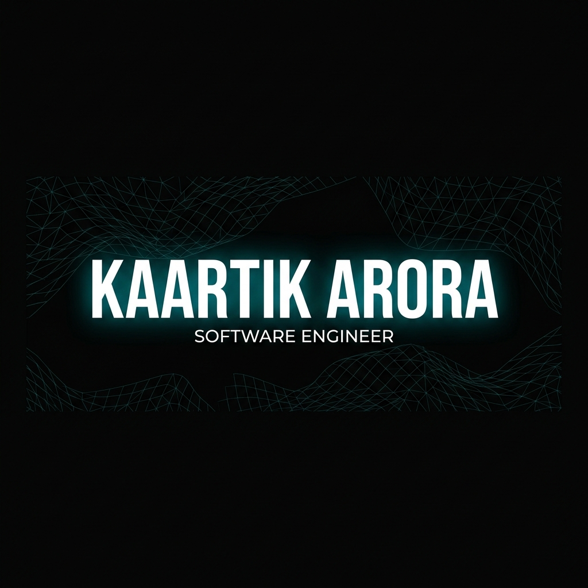

<!-- ╔══════════════════════════════════════════════════════════════════╗ -->
<!-- ║                     K A A R T I K   A R O R A                   ║ -->
<!-- ║              — GitHub Profile v3 · Engineered to Impress —      ║ -->
<!-- ╚══════════════════════════════════════════════════════════════════╝ -->

<!-- ▄▄▄▄▄▄▄▄▄▄▄▄▄▄▄▄▄▄ HEADER ▄▄▄▄▄▄▄▄▄▄▄▄▄▄▄▄▄▄ -->



<div align="center">
  <a href="https://kaartikarora-dev.onrender.com"></a>
  <a href="https://drive.google.com/file/d/1emgdC8KTqcL35wki3gfRyMvOpwYnp0Hd/view?usp=sharing"></a>
  <a href="https://linkedin.com/in/kaartikarora01"></a>
  <a href="https://leetcode.com/u/Kaartik_Arora/"></a>
  <a href="mailto:kaartikarora0001@gmail.com"></a>
</div>

<br/>

<div align="center">
  
</div>

<br/>

<!-- ▄▄▄▄▄▄▄▄▄▄▄▄▄▄▄ STATS BANNER ▄▄▄▄▄▄▄▄▄▄▄▄▄▄▄ -->

<div align="center">
<table>
<tr>
<td align="center"><b>🏆 1810</b><br/><sub>LeetCode Rating</sub></td>
<td align="center"><b>💯 1250+</b><br/><sub>Problems Solved</sub></td>
<td align="center"><b>💼 Wells Fargo</b><br/><sub>SDE Intern</sub></td>
<td align="center"><b>🥇 1st Place</b><br/><sub>Invictus BITS</sub></td>
<td align="center"><b>🎯 Top 1.5%</b><br/><sub>Adobe Hackathon</sub></td>
<td align="center"><b>📈 98.8%ile</b><br/><sub>JEE Mains</sub></td>
</tr>
</table>
</div>

<br/>

<!-- ▄▄▄▄▄▄▄▄▄▄▄▄▄▄▄ ABOUT ME ▄▄▄▄▄▄▄▄▄▄▄▄▄▄▄ -->


<table align="center">
<tr>
<td width="60%" valign="top">

## `> whoami`

```js
const kaartik = {
  education  : "B.Tech IT @ Delhi Technological University",
  cgpa       : 8.867,
  role       : "SDE Intern @ Wells Fargo (5 / 3000+ selected)",
  communities: ["GDG DTU", "AWS Cloud Club DTU"],
  focus      : ["AI Products", "Scalable Backends", "Cloud Architecture"],
  funFact    : "I debug code in my dreams."
};
```

</td>
<td width="40%" valign="top" align="center">

## `> uptime`


<br/>

<picture>
  <source media="(prefers-color-scheme: dark)" srcset="https://raw.githubusercontent.com/number1coder01/number1coder01/output/github-contribution-grid-snake-dark.svg" />
  <source media="(prefers-color-scheme: light)" srcset="https://raw.githubusercontent.com/number1coder01/number1coder01/output/github-contribution-grid-snake.svg" />
  
</picture>

</td>
</tr>
</table>

<br/>

<!-- ▄▄▄▄▄▄▄▄▄▄▄ FEATURED: RESUMIND ▄▄▄▄▄▄▄▄▄▄▄ -->

<div align="center">

## `🧠 Featured Product`


**AI-powered Resume Intelligence Platform**

</div>

<br/>

<table align="center">
<tr>
<td width="50%" valign="top">

### The Problem

> Most resume analyzers provide **shallow ATS scores** and generic feedback — they fail to address industry-specific requirements, phrasing impact, and real recruiter behavior.

### The Solution

> Resumind combines **OpenAI + Claude** to generate deep technical resume reviews, improvement suggestions, recruiter-focused feedback, and career guidance.

<p>


</p>

</td>
<td width="50%" valign="top">

### Architecture

```
          ╭─────────────────╮
          │  Resume Upload   │
          ╰────────┬────────╯
                   │
          ╭────────▼────────╮
          │  Resume Parser   │
          ╰────────┬────────╯
                   │
       ╭───────────┴───────────╮
       │                       │
  ╭────▼─────╮          ╭─────▼────╮
  │  OpenAI  │          │  Claude  │
  ╰────┬─────╯          ╰─────┬───╯
       │                       │
       ╰───────────┬───────────╯
                   │
          ╭────────▼────────╮
          │ Analysis Engine  │
          ╰────────┬────────╯
                   │
          ╭────────▼────────╮
          │   Smart Report   │
          ╰────────┬────────╯
                   │
          ╭────────▼────────╮
          │  User Dashboard  │
          ╰─────────────────╯
```

</td>
</tr>
</table>

<br/>

<!-- ▄▄▄▄▄▄▄▄▄▄▄▄▄▄ PROJECTS ▄▄▄▄▄▄▄▄▄▄▄▄▄▄ -->

<div align="center">

## `🏗 Project Showcase`

</div>

<!-- Project 1 -->
<details>
<summary><b>📊 ETL Analytics Pipeline</b> — Cloud-native data engineering workflow</summary>
<br/>
<table><tr><td>

**Cloud-based analytics workflow using AWS and Google Looker Studio for automated data processing and reporting.**

```
Raw Data Sources ──▶ Data Extraction ──▶ Transformation Layer ──▶ AWS Processing ──▶ Storage ──▶ Looker Studio ──▶ Dashboard
```

  

</td></tr></table>
</details>

<!-- Project 2 -->
<details>
<summary><b>🏠 Roomify</b> — AI-powered room visualization platform</summary>
<br/>
<table><tr><td>

**AI-powered room visualization transforming 2D spaces into photorealistic 3D outputs using advanced image processing.**

```
Room Image ──▶ AI Processing ──▶ 3D Generation ──▶ Visualization ──▶ Final Design
```

  

</td></tr></table>
</details>

<!-- Project 3 -->
<details>
<summary><b>💬 Realtime Chat Application</b> — 2000+ concurrent connections &nbsp; <a href="https://chat-application-qaut.onrender.com"></a></summary>
<br/>
<table><tr><td>

**High-performance WebSocket-based chat application.**

| Metric | Value |
|:---|:---|
| Concurrent Connections | **2000+** |
| Chat Rooms | **100+** |
| Latency | **~150ms** |
| Features | Geo-sharing, Profanity Filter, Real-time |

```
Client ──▶ Socket.IO ──▶ Node.js Server ──▶ Room Manager ──▶ Users
```

  

</td></tr></table>
</details>

<!-- Project 4 -->
<details>
<summary><b>🛒 E-Commerce Platform</b> — Production-grade MERN application</summary>
<br/>
<table><tr><td>

**Full-stack platform with JWT authentication, role-based access, admin dashboard, product management, and email automation.**

   

</td></tr></table>
</details>

<!-- Project 5 -->
<details>
<summary><b>💼 Job Portal</b> — Modern React recruitment platform &nbsp; <a href="https://github.com/number1coder01/job-portal-react"></a></summary>
<br/>
<table><tr><td>

**Modern React-based job portal with structured job listings, authentication flow, and responsive UI.**

  

</td></tr></table>
</details>

<!-- Project 6 -->
<details>
<summary><b>💻 MacBook 3D Landing Page</b> — Interactive Three.js + GSAP experience</summary>
<br/>
<table><tr><td>

**Frontend excellence showcase utilizing Three.js and GSAP for 60FPS scroll-driven 3D animations and storytelling.**

  

</td></tr></table>
</details>

<br/>

<!-- ▄▄▄▄▄▄▄▄▄▄▄▄ JOURNEY ▄▄▄▄▄▄▄▄▄▄▄▄ -->

<div align="center">

## `⏳ Engineering Journey`

```
                                                                        ╭──── NOW ────╮
                                                                        │              │
  2022 ──────── 2023 ──────── 2024 ──────── 2025 ──────── 2026 ─────── │    FUTURE    │
    │             │             │             │             │            │              │
 Started       Java &       Full Stack     1810 LC      Wells Fargo    ╰──────────────╯
Programming    DSA          + GDG DTU     Adobe Top     + Resumind       AI & Cloud
                            + AWS Club      1.5%                         Products
```

</div>

<br/>

<!-- ▄▄▄▄▄▄▄▄▄▄▄▄ TECH STACK ▄▄▄▄▄▄▄▄▄▄▄▄ -->

<div align="center">

## `🛠 Tech Stack`

| | Technologies |
|:---|:---|
| **Languages** |  |
| **Backend** |  |
| **Frontend** |  |
| **Databases** |  |
| **DevOps & Tools** |  |

</div>

<br/>

<!-- ▄▄▄▄▄▄▄▄▄▄▄ GITHUB ANALYTICS ▄▄▄▄▄▄▄▄▄▄▄ -->

<div align="center">

## `📈 GitHub Analytics`


<br/><br/>

&nbsp;&nbsp;


<br/><br/>


<br/><br/>


</div>

<br/>

<!-- ▄▄▄▄▄▄▄▄▄▄▄ LEETCODE ▄▄▄▄▄▄▄▄▄▄▄ -->

<div align="center">

## `🎯 Competitive Programming`

<a href="https://leetcode.com/u/Kaartik_Arora/">
  
</a>

<br/><br/>

`Rating: 1810` &nbsp;·&nbsp; `1250+ Solved` &nbsp;·&nbsp; `Top 6%` &nbsp;·&nbsp; `Active Contestant`

</div>

<br/>

<!-- ▄▄▄▄▄▄▄▄▄▄ LEARNING ▄▄▄▄▄▄▄▄▄▄ -->

<div align="center">

## `🌱 Currently Exploring`


</div>

<br/>

<!-- ▄▄▄▄▄▄▄▄▄▄▄▄▄▄ FOOTER ▄▄▄▄▄▄▄▄▄▄▄▄▄▄ -->


<div align="center">

<samp>

**Building products, solving problems, and exploring the systems behind them.**

</samp>

<br/>

<a href="https://kaartikarora-dev.onrender.com"></a>&nbsp;
<a href="https://linkedin.com/in/kaartikarora01"></a>&nbsp;
<a href="mailto:kaartikarora0001@gmail.com"></a>&nbsp;
<a href="https://leetcode.com/u/Kaartik_Arora/"></a>

<br/><br/>


</div>

<!-- trigger snake workflow -->
